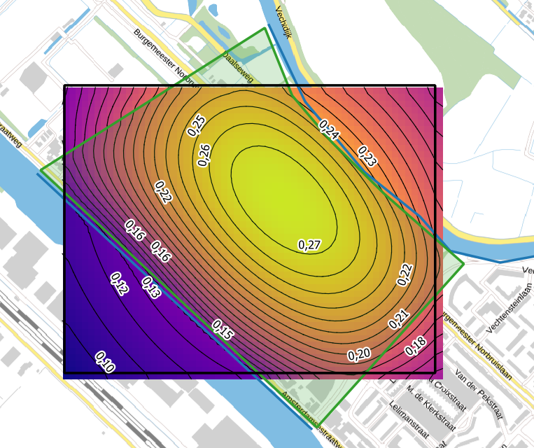
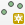
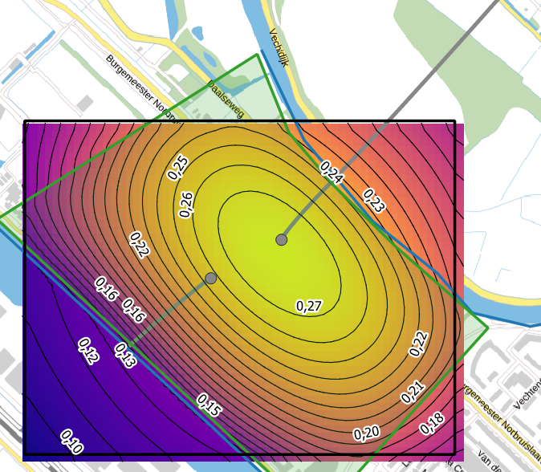
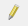
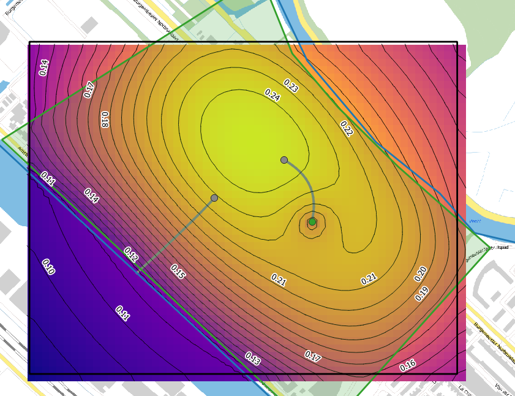

## Requirements
- Be sure QGIS version 3.40 or later is installed
- Be sure the QGIS-Tim plugin version 0.7.0 or later is installed (see [installation](install.qmd) for instructions).
- Be sure the ``gistim`` version 0.7.0 or later is installed (see [installation](install.qmd) for instructions).

## Description

In this tutorial, we will show how to use the particle tracking feature of
QGIS-Tim. This feature allows you to track the movement of particles in a
groundwater flow field, which can be useful for understanding the flow paths and
travel times of groundwater. We will use a simple example to demonstrate how to
set up and run a particle tracking simulation using QGIS-Tim.

## Getting Started

(@) Launch QGIS

We start with the creation of a new QGIS project.

(@) From the main menu click on *Project* and select *New*.

The case in this tutorial is located in The Netherlands, so next we select the appropriate projection.

(@) From the main menu click on *Project* and select *Properties*.
(@) In the *Properties* window select the category *CRS*, search for “EPSG:28992” and you find “Amersfoort / RD New”. Select this option and click the *Apply* button, followed by the *OK* button to close the window.

(@) Go to *Project* in the main menu, select *Save As* and select a folder and a file name for your project, e.g. “…\\QGIS-Tim_Tutorial\\particle_tracking.qgz”

## Load the tutorial data

(@) First we'll open the model which is part of the tutorial material
<INSERT_LINK_TO_MODEL> . Click on *Model Manager*, click *Open* and select
""./Zuilen_particle_tracking.gpkg"".

This wil load the model into the QGIS-Tim plugin. The model consists of a single
layer with a recharge area (Polygon Area Sink) inbetween two rivers. Let's
compute the groundwater head distribution in the model area.

(@) Click on *Results* and click on *Compute* to compute the groundwater head
distribution. After the computation is finished, the groundwater head
distribution will be visualized in the map canvas.

## Forward Particle Tracking

Next, let's release some particles in the model and track their movement.

(@) Go to *Elements* and click the *Particle Forward* button. Provide a layer name in the prompt (e.g. "particle") and click *OK*.

(@) Select the "steady-state Particle Forward" on the left.

(@) Click your
right mouse button and select the *Toggle Editing Mode*
({width=4%}).

(@) Click the *Add Point Feature* button
({width=4%}) and click in the
map canvas to add a particle. (TIP: For a nice result, place the particle near
the maximum groundwater head.) You can add as many particles as you like, but
for this tutorial we will add just one particle.

(@) This will open a form to enter the attributes of the particle. Fill in the
following values:

| parameter  | value | unit | comment|
|---          |---    |--- |--- |
| fid         | Autogenerate  | [-]  | ID is autogenerated by QGIS |
| Label       | 1     | [-]  | |
| z_start | -10   | [m MSL] | starting depth of the particle |
| max_horizontal_step | 10 | [m MSL]| maximum horizontal step size |
| vertical_step_fraction  | 0.1 | [-]| maximum vertical step as fraction of layer thickness |
| nstep_max  | 100 | [-]| maximum number of steps |

The latter three paramaters control the step size of the particle tracking.
Decreasing the step size will increase the accuracy of the particle tracking,
but also increase the computation time.

(@) After filling in the attributes, click *OK* to save the particle.

(@) Click on *Results* and then under *Output* select the *Particle Pathlines*
checkbox.

(@) Next press *Compute* again to compute the particle tracking results. After
the computation is finished, the particle track will be visualized in the map
canvas.

You'll see that particles sent in the direction of the Vecht river (the river on
the right) will not be captured by the river, whereas the particles sent in the
direction of the Amsterdam Rijn Kanaal (ARK) will be captured by the canal.

**Exercise**: Investigate which River parameter causes this difference in
behavior by comparing the attribute tables of the Vecht river and the Amsterdam
Rijn Kanaal (ARK). Feel free to modify the parameters of the Vecht river and see
how this affects the particle tracking results.

## Travel times

Let's also investigate the travel time of the particles.

(@) Open the *Temporal Controller* of QGIS (in the toolbar on top).
({width=4%}).

(@) In the Temporal Controller panel click the green play button "Animated
temporal navigation" on the right of the menu
({width=14%}).

Navigation buttons appear which allow you to control the animation of the particle tracking results.

(@) First, make sure the animation range is set properly by clicking the "Set to
full range" button
({width=4%}).

(@) Second, set the step size to 10 years. This means that the animation will show
the particle positions every 10 years.

(@) Next, click the play button to start the animation. You should see the
particles moving as line segments. These line segments represent the pathlines
of the particles within the selected time frame (of 10 years). This time frame
is shown on top next to the temporal controller panel menu.

(@) Finally, you can view the tracelines of the particles in their entirety
again by clicking the red cross button ("Turn off temporal navigation") on the
left of the menu
({width=14%}).

**Note** that closing the temporal controller panel will NOT turn off the
temporal navigation.

## Introducing a well

Let's introduce a well in the model and investigate how this affects the
particle's direction and travel time.

(@): Place a well roughtly in the center of the model, by clicking *Elements* and then clicking the *Well* button.

(@) Provide a name to the layer

(@) Start editing your new well layer by clicking the *Toggle Editing Mode* button ({width=4%}).

(@) Click the *Add Point Feature* button ({width=4%}).

(@) This will open a form to enter the attributes of the well. Fill in the following values:

| parameter  | value | unit | comment|
|---          |---    |--- |--- |
| fid         | Autogenerate  | [-]  | ID is autogenerated by QGIS |
| discharge | 30   | [m3/d] | |
| radius | 0.1 | [m]|  |
| resistance  | 0 | [d] | |
| layer  | 0 | [-]| |
| label       | 1     | [-]  | |

(@) After filling in the attributes, click *OK* to save the well.

(@) Next press *Compute* again to compute the particle tracking results.

## Investigate the capture zone

Let's introduce trace some particles backwards to investigate the capture zone
of the well.

(@) Click the *Particle Backward* button. Provide a layer name in the prompt
(e.g. "capture_zone") and click *OK*.

(@) Select the "steady-state Particle Backward" on the left.

(@) Click your right mouse button and select the *Toggle Editing Mode* button
({width=4%}).

(@) Zoom in to the well you placed. Click the *Add Point Feature* button
({width=4%}) and click in the
map canvas to add a particles just around the well.

(@) This will open a form to enter the attributes of the particle. Fill in the following values:

| parameter  | value | unit | comment|
|---          |---    |--- |--- |
| fid         | Autogenerate  | [-]  | ID is autogenerated by QGIS |
| Label       | 1     | [-]  | |
| z_start | -40   | [m MSL] | starting depth of the particle |
| max_horizontal_step | 10 | [m MSL]| maximum horizontal step size |
| vertical_step_fraction  | 0.1 | [-]| maximum vertical step as fraction of layer thickness |
| nstep_max  | 50 | [-]| maximum number of steps |

(@) After filling in the attributes, click *OK* to save the particle.

(@) Next press *Compute* again to compute the particle tracking results.

**Note:** When particles travel for a very long time, the amount of years might
exceed the maximum of years allowed in the geopackage (9999 years). In
case this happens, you can decrease nstep_max to a lower value (e.g. 30) and
recompute the particle tracking results.
